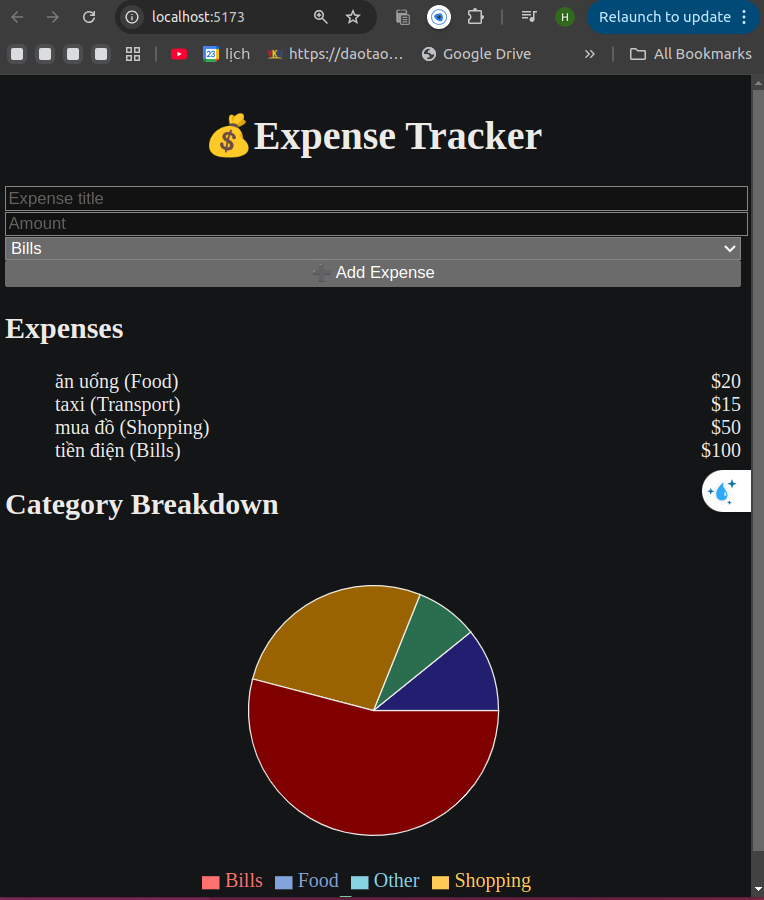

# 💰 Expense Tracker

Ứng dụng **theo dõi chi tiêu cá nhân** được xây dựng bằng **React + Vite + Tailwind CSS**.  
Người dùng có thể:
- Thêm chi tiêu kèm số tiền và phân loại (Food, Transport, Shopping, Bills, Other).
- Xem danh sách chi tiêu.
- Xem biểu đồ phân bổ chi tiêu theo danh mục (Pie Chart).



---

## 🚀 Công nghệ sử dụng
- [React](https://react.dev/) – thư viện xây dựng giao diện.
- [Vite](https://vitejs.dev/) – công cụ build và dev server nhanh.
- [Tailwind CSS](https://tailwindcss.com/) – framework CSS tiện lợi.
- [Recharts](https://recharts.org/) – thư viện vẽ biểu đồ.

---

## ⚙️ Cài đặt & Chạy dự án

### 1. Clone project
```bash
git clone https://github.com/<your-username>/expense-tracker.git
cd expense-tracker

